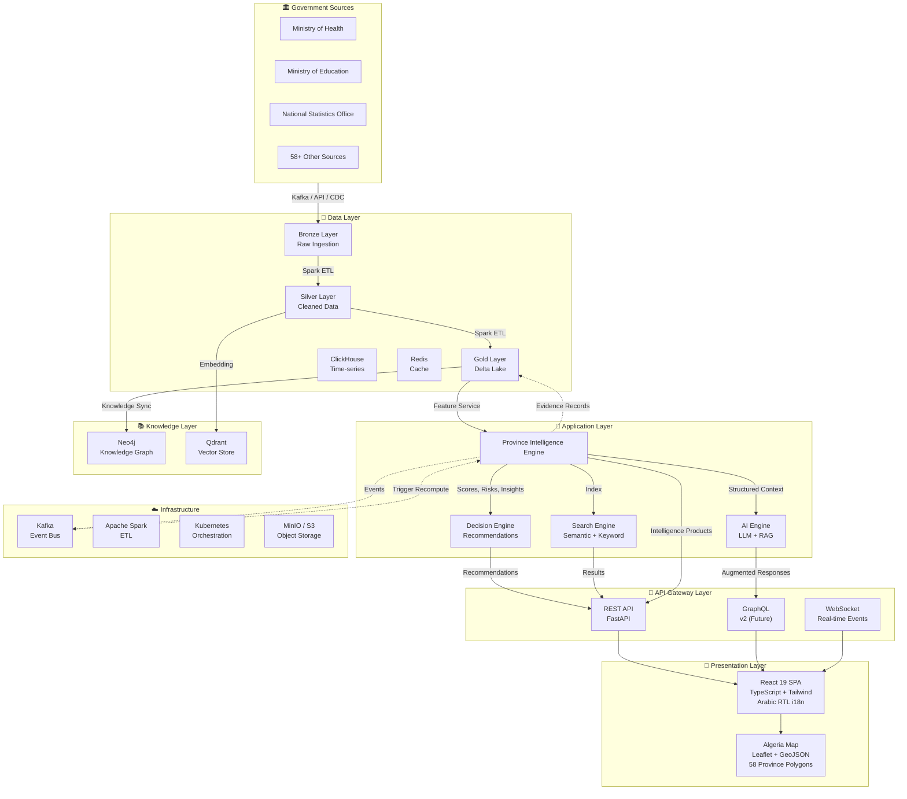

<p align="center">
  <picture>
    <source media="(prefers-color-scheme: dark)" srcset="https://placehold.co/160x160/1a1a2e/e0e0e0?text=M&font=raleway">
    
  </picture>
</p>

<h1 align="center">Monadhama</h1>

<h3 align="center">AI Operating System for Government Intelligence</h3>

<p align="center">
  Transform fragmented government data into trusted, explainable, actionable intelligence.
</p>

<p align="center">
  <a href="#"></a>
  <a href="#"></a>
  <a href="#"></a>
  <a href="#"></a>
  <a href="#"></a>
  <a href="#"></a>
  <a href="#"></a>
  <a href="#"></a>
</p>

<p align="center">
  <a href="#overview">Overview</a> •
  <a href="#features">Features</a> •
  <a href="#architecture">Architecture</a> •
  <a href="#getting-started">Getting Started</a> •
  <a href="#documentation">Documentation</a> •
  <a href="#roadmap">Roadmap</a>
</p>

<br>

---

## Overview

**Monadhama** (منظمة — Arabic for "Organization") is an AI-powered government intelligence platform purpose-built to close the gap between raw data and executive decision-making.

### The Problem

Governments today sit on vast troves of data — yet decision-making remains fragmented, reactive, and opaque. Ministries operate in silos. Data is collected but never connected. Critical signals are buried in spreadsheets. Executives rely on intuition because no system exists to transform evidence into insight at the speed of governance.

### What Monadhama Does

Monadhama ingests the full spectrum of government data, constructs a living knowledge model of the state, and delivers explainable, prioritized intelligence to decision makers. It is not a dashboard, not a BI tool, and not a chatbot bolted onto a database. It is a **purpose-built intelligence operating system** for government.

### How It's Different

| | Traditional BI | Chatbots / LLM Wrappers | Monadhama |
|---|---|---|---|
| **Data Model** | Flat tables, siloed | No persistent model | Ontology-driven knowledge graph |
| **Decision Support** | Static reports, manual analysis | Single-turn Q&A | Multi-engine intelligence pipeline |
| **Explainability** | None — "the number is the number" | Hallucination-prone | L1–L4 evidence chain on every output |
| **Proactivity** | Pull — user must know what to ask | Reactive — user must prompt | Push — risks, opportunities, recommendations surfaced automatically |
| **Scale** | Single department | Single dataset | 58 provinces, 12 sectors, 200+ sources |
| **Language** | English-first | English-first | **Arabic-primary** (default RTL), French, English |
| **Trust** | Low — no provenance | Low — no grounding | High — evidence engine, audit trail, deterministic scoring |

<br>

> **Monadhama is built for Algeria first — designed for every government on Earth.**

---

## Vision

<p align="center">
  <strong>Monadhama will become the operating system for government intelligence globally.</strong>
</p>

From a single deployment covering 58 Algerian wilayas to a platform that powers executive decision-making across nations, Monadhama's long-term trajectory is clear:

| Era | Capability | Impact |
|---|---|---|
| **Phase 1 — Foundation** | Province intelligence, 12-dimension scoring, AI insights | Understand the state |
| **Phase 2 — Intelligence** | Risk detection, opportunity discovery, executive recommendations | Anticipate the future |
| **Phase 3 — Enterprise** | Knowledge graph, digital twin, scenario simulation | Simulate the possible |
| **Phase 4 — National Scale** | Real-time dashboard, multi-ministry federation, cross-country comparison | Govern the nation |
| **Post-Launch** | Predictive governance, autonomous policy analysis, global intelligence network | Transform governance |

Monadhama evolves from a passive information aggregator to an active governance partner that **monitors** every province and sector in real time, **detects** anomalies and risks before they become crises, **recommends** resource allocation and policy interventions with full evidence chains, **explains** why each recommendation was made and what the trade-offs are, and **learns** from outcomes to continuously improve its models.

---

## Features

| Capability | Description | Status |
|---|---|---|
| **🗺️ Interactive Province Map** | Full-screen Leaflet map of Algeria with 58 province polygons, color-coded by intelligence score, click-to-detail, and hover tooltips | ✅ Complete |
| **📊 Province Intelligence Profiles** | 12-dimension scoring (Health, Education, Economy, Employment, Investment, Infrastructure, Security, Environment, Transport, Water, Agriculture, Tourism) with trend, confidence, and source count per dimension | ✅ Complete |
| **📈 Province Intelligence Score (PIS)** | Unified 0–100 composite score synthesized from all 12 dimensions with confidence adjustment, trend momentum, and missing-data penalty | ✅ Complete |
| **🤖 AI Assistant** | Conversational interface with province-aware responses, data card rendering, source citations, and RAG-style grounded answers | ✅ Complete |
| **🎯 Decision Center** | Structured recommendation engine: immediate interventions, strategic investments, policy changes, resource reallocations — with evidence, impact estimation, and alternatives considered | ✅ Complete |
| **📑 Report Generator** | Automated intelligence briefings with multi-language support (Arabic/French/English), sector filtering, time-range selection | ✅ Complete |
| **🔍 Command Search** | ⌘K command palette with semantic search across provinces, indicators, insights, and actions | ✅ Complete |
| **⚖️ Province Comparison** | Side-by-side comparison of any provinces across all 12 dimensions with visual radar overlay | ✅ Complete |
| **📝 Executive Summary** | Auto-generated per-province brief with strengths, challenges, priority sectors, risks, opportunities, and data confidence | ✅ Complete |
| **🔄 Cross-Province Intelligence** | Automatic discovery of similar, competing, emerging, declining, and outlier provinces with explainable criteria | ✅ Complete |
| **📈 Health Evolution** | Multi-window historical tracking (30d / 90d / 1yr / 5yr) with trajectory projection, regime change detection, and volatility metrics | ✅ Complete |
| **🔗 Evidence Engine** | Every intelligence product grounded in traceable evidence — source references, indicator references, dataset lineage, validation status | ✅ Complete |
| **💡 Explainability (L1–L4)** | Four-level drill-down: executive summary → human explanation → indicator breakdown → raw data lineage. Every number verifiable to its source | ✅ Complete |
| **🌐 Arabic-First i18n** | Native Arabic (RTL) as default language with instant switching to French and English — fully translated UI, mock data, insights, and reports | ✅ Complete |
| **🎨 Enterprise Design System** | Linear-grade UI components: data tables, modals, badges, avatars, skeletons, dropdowns, tabs, custom chart library (radar, bar, line, gauge) | ✅ Complete |
| **🏛️ Government Data Strategy** | 22 architecture documents covering data contracts, source registry, quality gates, Bronze/Silver/Gold lake architecture, ministry onboarding playbook | ✅ Complete |

---

## Architecture

Monadhama is built on a six-layer architecture designed for modularity, explainability, and sovereign deployment.



<p align="center">
  <em>For detailed architecture documentation, see <a href="docs/architecture.md">architecture.md</a> and <a href="docs/province_intelligence_engine.md">province_intelligence_engine.md</a>.</em>
</p>

---

## Technology Stack

### Frontend

| Technology | Purpose |
|---|---|
| **React 19** | UI framework with concurrent features |
| **TypeScript 5.7** | Type-safe development |
| **Vite 6** | Build tool and dev server |
| **Tailwind CSS 3.4** | Utility-first styling |
| **Framer Motion** | Declarative animations |
| **Leaflet + react-leaflet** | Interactive Algeria map with GeoJSON |
| **Recharts** | Composable chart library (radar, bar, line, gauge) |
| **react-i18next** | Internationalization (Arabic primary, French, English) |
| **lucide-react** | Icon library with RTL-aware mirroring |
| **zustand** | Lightweight state management |
| **TanStack React Query** | Server state and caching |
| **react-router-dom v7** | Client-side routing |

### Backend (Planned)

| Technology | Purpose |
|---|---|
| **FastAPI (Python 3.12+)** | REST API framework |
| **Pydantic v2** | Data validation and schemas |
| **Neo4j 5.x** | Knowledge graph |
| **Qdrant** | Vector store for semantic search |
| **ClickHouse** | Time-series indicator storage |
| **PostgreSQL 16 + Citus** | Primary database and analytics |
| **Delta Lake** | Data lake with ACID transactions |
| **Apache Kafka** | Event bus for PIE topics |
| **Apache Spark** | Distributed ETL and scoring |
| **LangChain + LangGraph** | AI orchestration |
| **Kubernetes (k3s)** | Container orchestration |

### Languages

| Language | Version | Use |
|---|---|---|
| TypeScript | 5.7+ | Frontend, API types |
| Python | 3.12+ | Backend, AI/ML, data processing |
| Go | 1.22+ | Infrastructure tooling (future) |
| Rust | 1.75+ | Performance-critical services (future) |

<details>
<summary><strong>📋 Full technology stack</strong> — 35+ technologies across all layers</summary>

<br>

| Layer | Primary | Alternative |
|---|---|---|
| Frontend | React 19 + TypeScript + Vite | Next.js (considering) |
| Backend | FastAPI (Python 3.12) | Go, Rust |
| Graph DB | Neo4j 5.x | Amazon Neptune |
| Vector DB | Qdrant | Pinecone, Milvus |
| Time Series | ClickHouse | TimescaleDB |
| Data Warehouse | PostgreSQL 16 + Citus | CockroachDB |
| Data Lake | Delta Lake | Apache Iceberg |
| Object Storage | MinIO | S3, GCS, Azure Blob |
| Stream Processing | Apache Kafka + Kafka Connect | Redpanda |
| Batch Processing | Apache Spark | Dask |
| Orchestration | Kubernetes (k3s/k8s) | Nomad |
| Service Mesh | Istio | Linkerd |
| API Gateway | Kong | Envoy |
| Identity | Keycloak | Auth0, Azure AD |
| Secrets | HashiCorp Vault | AWS Secrets Manager |
| Monitoring | Prometheus + Grafana | Datadog |
| Logging | ELK Stack | Loki + Grafana |
| Tracing | OpenTelemetry + Jaeger | Datadog APM |
| Workflow | Apache Airflow | Prefect |
| AI Framework | LangChain + LangGraph | LlamaIndex |
| ML Platform | MLflow | Kubeflow |
| GPU Inference | NVIDIA Triton | vLLM |
| CI/CD | GitHub Actions + ArgoCD | GitLab CI |
| IaC | Terraform + Helm | Pulumi |

</details>

---

## Screenshots

> *Screenshots represent the current development build with mock data.*

<p align="center">
  <table>
    <tr>
      <td align="center"><strong>Executive Dashboard</strong></td>
      <td align="center"><strong>Province Detail</strong></td>
    </tr>
    <tr>
      <td>
        <a href="#">
          <picture>
            <source media="(prefers-color-scheme: dark)" srcset="https://placehold.co/600x380/1a1a2e/666666?text=Dashboard+Preview&font=raleway">
            
          </picture>
        </a>
      </td>
      <td>
        <a href="#">
          <picture>
            <source media="(prefers-color-scheme: dark)" srcset="https://placehold.co/600x380/1a1a2e/666666?text=Province+Detail&font=raleway">
            
          </picture>
        </a>
      </td>
    </tr>
    <tr>
      <td align="center"><strong>Province Comparison</strong></td>
      <td align="center"><strong>AI Assistant</strong></td>
    </tr>
    <tr>
      <td>
        <a href="#">
          <picture>
            <source media="(prefers-color-scheme: dark)" srcset="https://placehold.co/600x380/1a1a2e/666666?text=Comparison&font=raleway">
            
          </picture>
        </a>
      </td>
      <td>
        <a href="#">
          <picture>
            <source media="(prefers-color-scheme: dark)" srcset="https://placehold.co/600x380/1a1a2e/666666?text=AI+Assistant&font=raleway">
            
          </picture>
        </a>
      </td>
    </tr>
    <tr>
      <td align="center"><strong>Decision Center</strong></td>
      <td align="center"><strong>Reports</strong></td>
    </tr>
    <tr>
      <td>
        <a href="#">
          <picture>
            <source media="(prefers-color-scheme: dark)" srcset="https://placehold.co/600x380/1a1a2e/666666?text=Decision+Center&font=raleway">
            
          </picture>
        </a>
      </td>
      <td>
        <a href="#">
          <picture>
            <media media="(prefers-color-scheme: dark)" srcset="https://placehold.co/600x380/1a1a2e/666666?text=Reports&font=raleway">
            
          </picture>
        </a>
      </td>
    </tr>
  </table>
</p>

---

## Project Structure

```
monadhama/
├── docs/                                    # 23 architecture documents
│   ├── architecture.md                      # System architecture
│   ├── province_intelligence_engine.md      # PIE — core intelligence layer
│   ├── ai_engine.md                         # AI orchestration
│   ├── decision_engine.md                   # Recommendation system
│   ├── data_engine.md                       # Data pipeline architecture
│   ├── government_data_strategy.md          # Data governance strategy
│   ├── priority_scoring.md                  # Scoring methodology
│   ├── knowledge_model.md                   # Knowledge graph ontology
│   ├── technology_stack.md                  # Full technology specifications
│   ├── roadmap.md                           # Development milestones
│   ├── security.md                          # Enterprise security
│   ├── deployment.md                        # Kubernetes deployment
│   └── ... (11 more)
│
├── frontend/                                # React SPA (complete)
│   ├── src/
│   │   ├── App.tsx                          # Root application component
│   │   ├── main.tsx                         # Application entry point
│   │   │
│   │   ├── pages/                           # 10 route pages
│   │   │   ├── dashboard.tsx                # Executive dashboard
│   │   │   ├── provinces.tsx                # Province explorer
│   │   │   ├── province-detail.tsx          # Province intelligence profile
│   │   │   ├── compare.tsx                  # Province comparison
│   │   │   ├── decisions.tsx                # Decision center
│   │   │   ├── assistant.tsx               # AI assistant
│   │   │   ├── reports.tsx                  # Report generator
│   │   │   ├── search.tsx                   # Command search
│   │   │   ├── settings.tsx                 # Settings & language
│   │   │   └── login.tsx                    # Authentication
│   │   │
│   │   ├── components/
│   │   │   ├── layout/                      # App shell (sidebar, topbar)
│   │   │   ├── charts/                      # Custom chart library
│   │   │   ├── map/                         # Interactive Algeria map
│   │   │   ├── scores/                      # Score cards & displays
│   │   │   ├── search/                      # Command palette
│   │   │   ├── ai/                          # AI conversation UI
│   │   │   └── ui/                          # Design system (10+ components)
│   │   │
│   │   ├── hooks/                           # Custom React hooks
│   │   ├── i18n/                            # Internationalization
│   │   │   ├── ar.json                      # Arabic (primary, 1,000+ lines)
│   │   │   ├── fr.json                      # French
│   │   │   └── en.json                      # English
│   │   ├── lib/                             # Utilities & mock data
│   │   └── styles/                          # Global CSS
│   │
│   ├── package.json
│   ├── tsconfig.json
│   ├── vite.config.ts
│   └── tailwind.config.ts
│
├── infrastructure/                          # Terraform, Helm (future)
├── scripts/                                 # Utility scripts (future)
├── tests/                                   # Test suites (future)
└── README.md                                # You are here
```

---

## Getting Started

### Prerequisites

| Requirement | Version |
|---|---|
| Node.js | 18.x or later |
| npm | 9.x or later |
| Python (backend) | 3.12+ (future) |
| Docker | 24.x+ (future) |
| Kubernetes | 1.28+ (future) |

### Development

```bash
# Clone the repository
git clone https://github.com/your-org/monadhama.git
cd monadhama

# Install frontend dependencies
cd frontend
npm install

# Start the development server
npm run dev
```

The application launches at **`http://localhost:3000`** with full Arabic RTL support by default.

### Build

```bash
# TypeScript type checking
npx tsc --noEmit

# Production build
npm run build

# Preview production build
npm run preview
```

The build produces optimized static assets in `frontend/dist/` — **66KB CSS, 1.36MB JavaScript** with 0 TypeScript errors.

### Verification

```bash
npx tsc --noEmit    # ✅ 0 errors guaranteed
npm run build        # ✅ Successful production build
```

---

## Roadmap

### ✅ Completed

- [x] **22 enterprise architecture documents** — full system design
- [x] **Complete React frontend** — 42 source files across 10 pages
- [x] **Interactive Algeria map** — Leaflet + GeoJSON, 58 province polygons
- [x] **12-dimension province scoring** — Health, Education, Economy, Employment, Investment, Infrastructure, Security, Environment, Transport, Water, Agriculture, Tourism
- [x] **Province Intelligence Score (PIS)** — unified 0–100 composite with confidence adjustment
- [x] **Executive Summary Generator** — AI-powered per-province briefs
- [x] **Cross-Province Intelligence** — similar, competing, emerging, declining, outlier classification
- [x] **Province Health Evolution** — 30d / 90d / 1yr / 5yr windows with trajectory
- [x] **Evidence Engine** — every intelligence product traceable to source
- [x] **4-Level Explainability** — L1 Executive → L2 Human → L3 Indicators → L4 Raw Lineage
- [x] **Full Arabic i18n + RTL** — Arabic as default, French/English instant switch
- [x] **Command palette (⌘K)** — semantic search across provinces and indicators
- [x] **AI Assistant** — conversation UI with grounded, source-cited responses
- [x] **Decision Center** — structured recommendations with evidence and alternatives
- [x] **Report Generator** — customizable intelligence briefings
- [x] **Enterprise UI design system** — 10+ components, Light/Dark mode
- [x] **Zero TypeScript errors** — `npx tsc --noEmit` passes clean
- [x] **Successful production build** — Vite build verified

### 🔄 In Progress

- [ ] Province Intelligence Engine backend services (Phase 1)
- [ ] Real government data onboarding — Health, Education, ONS
- [ ] API layer (REST + GraphQL contracts)
- [ ] Knowledge graph integration (Neo4j)

### 📅 Upcoming

- [ ] **Q3 2026** — MVP Launch: 20 data sources, 58 provinces, basic AI
- [ ] **Q4 2026** — Phase 1 Foundation complete: full scoring, search, query
- [ ] **Q1 2027** — Phase 2 Intelligence: trend detection, risk alerting, auto-reports
- [ ] **Q2 2027** — Beta Launch: 50 data sources, full AI, limited pilot users
- [ ] **Q3 2027** — Phase 3 Enterprise: knowledge graph, digital twin, simulation
- [ ] **Q4 2027** — Phase 4 National Scale: real-time dashboard, multi-ministry
- [ ] **2028+** — Predictive governance, cross-country comparison, global network

---

## Documentation

Monadhama is documented across 23 architecture specifications. Every document is comprehensive, opinionated, and designed for enterprise-grade implementation.

### Core Architecture

| Document | Description |
|---|---|
| [Architecture Overview](docs/architecture.md) | Six-layer system architecture with component interactions |
| [Province Intelligence Engine](docs/province_intelligence_engine.md) | Core intelligence layer — scoring, insights, risks, recommendations, evidence, explainability |
| [AI Engine](docs/ai_engine.md) | LLM orchestration, RAG pipeline, prompt architecture |
| [AI Capabilities](docs/ai_capabilities.md) | AI capabilities matrix, model selection, performance benchmarks |

### Data & Knowledge

| Document | Description |
|---|---|
| [Government Data Strategy](docs/government_data_strategy.md) | Data governance framework, quality gates, sovereignty model |
| [Data Engine](docs/data_engine.md) | Bronze/Silver/Gold lake architecture, ETL pipelines |
| [Data Sources](docs/data_sources.md) | Source catalog — 200+ government data sources |
| [Database Design](docs/database_design.md) | Multi-model database strategy (PostgreSQL, Neo4j, ClickHouse, Qdrant) |
| [Knowledge Model](docs/knowledge_model.md) | Ontology definitions, entity relationships, graph schema |

### Business Logic

| Document | Description |
|---|---|
| [Decision Engine](docs/decision_engine.md) | Recommendation system architecture, human-in-the-loop design |
| [Priority Scoring](docs/priority_scoring.md) | Full scoring methodology, indicator catalog, weight configuration |
| [Government Entities](docs/government_entities.md) | Government entity catalog and relationship model |

### Engineering

| Document | Description |
|---|---|
| [Technology Stack](docs/technology_stack.md) | Complete technology recommendations with alternatives |
| [System Requirements](docs/system_requirements.md) | Functional and non-functional requirements |
| [Backend Design](docs/backend_design.md) | Microservices architecture, API contracts |
| [Frontend Design](docs/frontend_design.md) | Component architecture, state management, i18n strategy |
| [API Design](docs/api_design.md) | REST API specification, authentication, rate limiting |
| [Security](docs/security.md) | Enterprise security architecture, encryption, access control |
| [Deployment](docs/deployment.md) | Kubernetes deployment, CI/CD, infrastructure as code |

### Strategy

| Document | Description |
|---|---|
| [Vision](docs/vision.md) | Long-term product vision and strategic direction |
| [Roadmap](docs/roadmap.md) | Detailed development phases, milestones, and timelines |
| [MVP Architecture](docs/mvp_architecture.md) | Minimum viable product scope and design |
| [Future Versions](docs/future_versions.md) | Post-MVP expansion plans and capabilities |

---

## Design Principles

### 🔒 Trust

Every intelligence product in Monadhama is backed by a **verifiable chain of evidence**. The Evidence Engine ensures that no score, insight, risk, or recommendation reaches a decision maker without traceable provenance. We do not ask users to trust us — we give them the tools to verify.

### 💡 Explainability

No black boxes. Every output carries a **four-level explainability chain** (L1 Executive Summary → L2 Human Explanation → L3 Indicator Breakdown → L4 Raw Data Lineage). Every recommendation explains its reasoning, supporting evidence, confidence, and expected impact. AI augments explanations — it never computes core scores.

### 📈 Scalability

Built for 58 provinces today, designed for any number of countries tomorrow. All 12 services communicate through **Kafka event contracts** and can be independently scaled, replaced, or deployed. The data architecture (Bronze/Silver/Gold) handles from 10 to 10,000 sources without redesign.

### 🏛️ Security

**Sovereign by design.** Monadhama deploys on-premise or in sovereign cloud — government data never leaves government control. Every operation is audited. Access control is per-intelligence-product-classification (Official → Official-Sensitive → Confidential). The system meets enterprise government security requirements.

### 🌍 Government-First

Built for the unique constraints of government: Arabic-primary RTL interface, ministry-specific data contracts, configurable sovereignty, offline-capable deployment, and a procurement-friendly architecture. Not a consumer product rebranded for government — a system born in government, for government.

### 🧠 AI-First

AI is not a feature — it is the architecture. Every component is designed around AI workflows: the Feature Service feeds ML models, the Insight Engine uses anomaly detection, the Recommendation Engine applies multi-factor optimization. But AI is always **constrained by evidence** — LLMs augment, they never replace deterministic computation.

---

## Future Vision

| Phase | Capability | Impact |
|---|---|---|
| **Real Government Data** | Onboard Health, Education, ONS ministries via the data contract framework — PIE runs in shadow mode, comparing mock vs real outputs | Validated intelligence with real ministry data |
| **Knowledge Graph** | Full Neo4j graph with entity relationships — province → hospital → school → road → project. Graph traversal enables cross-entity insights | "Show all hospitals within 20km of roads with condition < 30" |
| **Digital Twin** | Province state snapshots feed a real-time digital twin. Historical replay, stress testing, and policy simulation | "What happens to water score if dam levels drop 20%?" |
| **Scenario Simulation** | Modify indicators, weights, or thresholds and recompute PIE outputs on demand. Three scenarios side by side | "Compare 5%, 10%, and 20% health budget increases" |
| **Forecasting** | ML models consume PIE's historical feature store and evolution windows to project scores 12 months ahead | "PIS projected to drop below 50 in 6 months at current trajectory" |
| **Multi-Country Support** | The architecture is country-agnostic. Province dimension model, data contracts, and ontology service accept any administrative hierarchy | Deploy for any government without redesign |

---

## Contributing

Monadhama is an open-source project (source-available license) and welcomes contributions from engineers, data scientists, domain experts, and government technologists.

### How to Contribute

1. **Fork** the repository
2. **Create a feature branch** (`git checkout -b feature/amazing-feature`)
3. **Commit your changes** (`git commit -m 'Add amazing feature'`)
4. **Push to the branch** (`git push origin feature/amazing-feature`)
5. **Open a Pull Request**

### Guidelines

| Area | Guideline |
|---|---|
| **Code style** | TypeScript strict mode, ESLint, Prettier. Python: PEP 8, Black, Ruff. |
| **i18n** | All user-facing text must use `t()` — no hardcoded strings. Arabic is primary. |
| **Testing** | PRs should include tests. Run `npm run test` before pushing. |
| **Documentation** | Every feature must include or update relevant documentation in `/docs`. |
| **Architecture** | Review `docs/architecture.md` and `docs/province_intelligence_engine.md` before making cross-cutting changes. |
| **Evidence** | Any new intelligence product must register with the Evidence Engine. |

### Reporting Issues

Report bugs, feature requests, and security concerns via GitHub Issues. For security vulnerabilities, please email the maintainers directly rather than opening a public issue.

---

## License

Proprietary — Government of Algeria / Monadhama Project.

Monadhama is developed under a source-available license. All rights reserved. The software is provided for evaluation and contribution purposes. Commercial use, deployment, or redistribution requires explicit authorization from the project sponsors.

*License terms will be updated as the project evolves toward open-source release.*

---

## Contact

| Channel | Link |
|---|---|
| **GitHub** | [github.com/your-org/monadhama](https://github.com/your-org/monadhama) |
| **Website** | [monadhama.gov.dz](https://monadhama.gov.dz) *(placeholder)* |
| **Email** | [contact@monadhama.gov.dz](mailto:contact@monadhama.gov.dz) *(placeholder)* |
| **LinkedIn** | [linkedin.com/company/monadhama](https://linkedin.com/company/monadhama) *(placeholder)* |

---

<p align="center">
  <strong>Monadhama</strong> — منظمة<br>
  <em>AI Operating System for Government Intelligence</em>
</p>

<p align="center">
  <sub>Built for Algeria · Designed for the world</sub>
</p>
